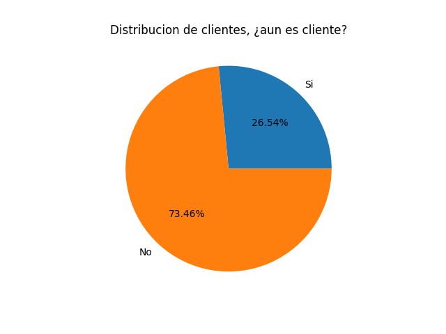
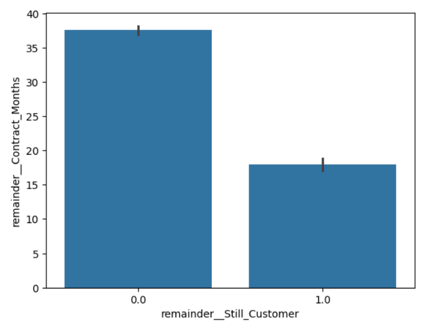
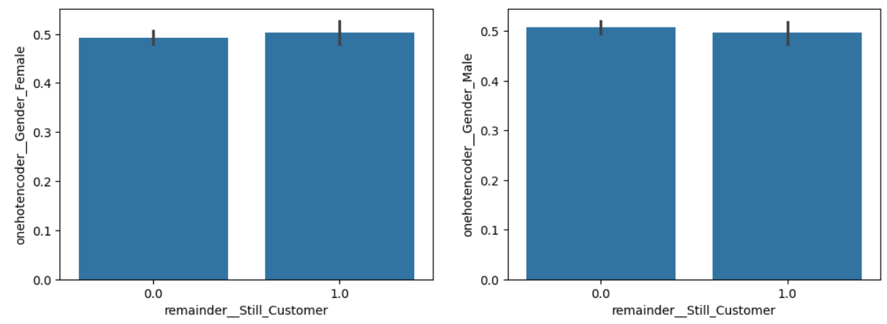
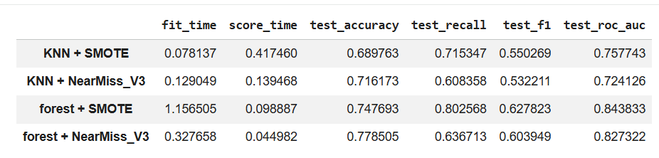
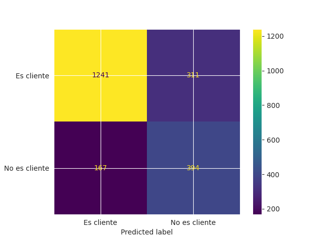

# Telecom-X-Machine-Learning
El proyecto se puede ejecutar en el siguiente enlace.
](https://colab.research.google.com/github/marmalux/Telecom-X-Machine-Learning/blob/main/Churn_de_clientes_Telecom_X.ipynb)

## Objetivo
La misión es crear modelos predictivos capaces de prever qué clientes tienen mayor probabilidad de cancelar sus servicios.
La empresa quiere anticiparse al problema de la cancelación, y te corresponde a ti construir un pipeline robusto para esta etapa inicial de modelado.
Este proyecto es una continuacion enfocada a ciencia de datos de un repositorio de esta misma cuenta

## Tecnologías y herramientas utilizadas
* Python (Google Colab)
* Pandas, Numpy
* De Matplotlib su módulo pyplot
* sklearn (model_selection/ensemble/metrics,preprocessing)
  * OneHotEncoder
  * RandomForestClassifer
  * KNeighborsClassifier
Para balanceo 

* imblearn (under_sanmple/over_sample,pipeline)
  * SMOTE
  * NearMiss
Normalizacion
* MinMaxScaler
## Dataset

Los datos para el modelo se tomaron de un proyecto de análisis de datos de otro repositorio en esta misma cuenta ya analizado y limpiado para comenzar con el análisis

``` 
url_api = 'https://github.com/marmalux/Telecom-X-Machine-Learning/raw/refs/heads/main/datos_tratados_Telecom_X.csv'
```
## Resumen de proceso
* **Preprocesamiento de datos**
* **Análisis visual y correlacion para conocer mejor los datos**
* **Modelado predictivo y evaluación de modelos**
  
### Preprocesamiento

Aqui se eliminan columnas que no son necesarias para el modelo como el Id, tambien columnas que se obtienen a partir de otras como el cargo mensual y cargo diario, o la cantidad de servicios usados para que no interfieran en el modelo

### Análisis visual 
Aquí vemos algunos comportamientos de nuestras variables a partir de nuestro mapa de calor una vez aplicado la codificación


Con el mapa de calor se puede observar que variables estan relacionadas y que puedan tener significancia en el modelo. Después se hace comparativas visuales entre el churn y variables categóricas para conocer mejor la informacion obtenida.




### Modelado predictivo y evaluación de modelos

Se hizo prueba de 2 modelos, el KNN y RandomForestClassifier, esto con el fin de tener 2 maneras de explicar el churn de clientes. Como consideraciones adicionales, se hizo un balance utilizando under_fiting y over_fiting para comparar cual tiene mejor respueta en cada modelo.

El modelo KNN como considera distancias mas cercanas a la variable objetivo, se hizo uso de la normalizacion MinMaxScaler para que no exista una variable mas significativa que otra y mejorar la precisión del modelo.
Se uso el pipeline de ibmlearn para agilizar el código y reducir el error que se introduciría en caso de hacer el codigo manualmente y se evalún  metricas como:
* Precisión (Accuracy) - mide que tan bien acierta los datos
* Sensibilidad (Recall) - De los clientes que si fueron Churn, cuantos detecto el modelo
* F1 - detecta el churn pero con menores falsas alarmas por lo que mientras mas alto sea mejor 
* ROC_AUC - que tan bien el modelo separa las clases de ser o no churn

**Resultados**

El resultado de estas pruebas se muestra en la siguente tabla


El modelo elegido es el RandomForesClassifier con balanceo oversampling el cual dio un mejor resultado en 'Recall' y 'F1' los cuales son importantes en este proyecto pues ayudan a detectar quienes se van como clientes. a partir de este modelo podemos observar su matriz de confusion para poder entender un poco mejor como clasifica.


## Conclusión

Gracias al modelo elegido RandomForest, podemos ver que las variables que mas afectan al modelo y que ayudan a determinar si es o no churn o si se quedan o se van fueron:
* Método de pago si es por cheque electrónico.
* Se da mas en el contrato de mes a mes, al menos mas que el que es por dos años.
* Los que contratan internet por fibra optica.
* los que no tienen un servicio de internet contratado.
* Los que reciben soporte técnico soporte

Con esto se deben tomar mas en cuenta para encontrar una estrategia de negocio para evitar que los clientes se marchen como por ejemplo dar promocion de servicio de internet a quien no lo tiene y esta bien con lo que tiene o por ejemplo ser mas accesible con el soporte al usuario.

## Autor
**Octavio Márquez Luna**

Correo
[octavio.marlu@gmail.com](mailto:octavio.marlu@gmail.com)
