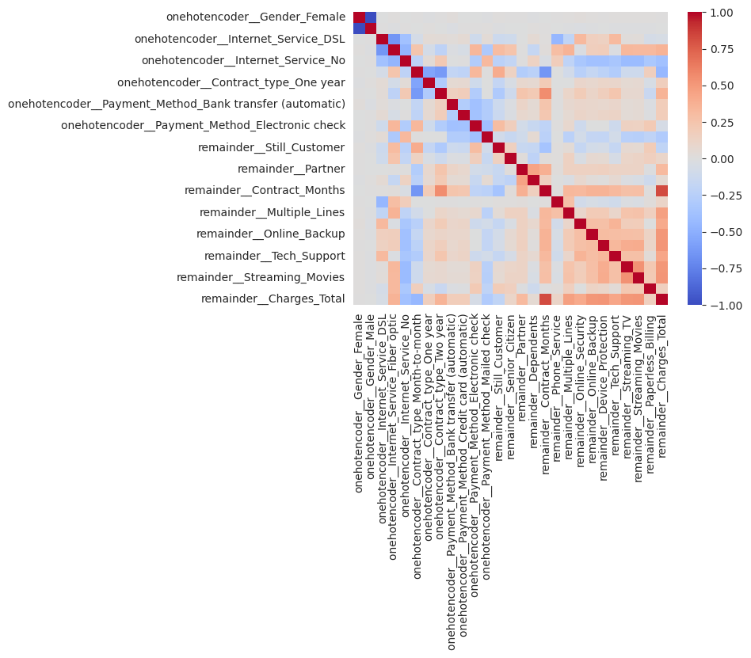

# Telecom-X-Machine-Learning

## Objetivo
La misión es crear modelos predictivos capaces de prever qué clientes tienen mayor probabilidad de cancelar sus servicios.
La empresa quiere anticiparse al problema de la cancelación, y te corresponde a ti construir un pipeline robusto para esta etapa inicial de modelado.
Este proyecto es una continuacion enfocada a ciencia de datos de un repositorio de esta misma cuenta

## Tecnologías y herramientas utilizadas
* Python (Google Colab)
* Pandas, Numpy
* De Matplotlip su módulo pyplot
* sklearn (model_selection/ensemble/metrics)
  * RandomForesClassifer
  * KNeighborsClassifier
Para balanceo 

* imblearn (under_sanmple/over_sample,pipeline)
  * SMOTE
  * NearMiss
## Dataset

Los datos para el modelo se tomaron de un proyecto de análisis de datos de otro repositorio en esta misma cuenta ya analizado y limpiado para comenzar con el análisis

``` 
url_api = 'https://github.com/marmalux/Telecom-X-Machine-Learning/raw/refs/heads/main/datos_tratados_Telecom_X.csv'
```
## Resumen de proceso
* **Preprocesamiento de datos**
* **Análisis visual y correlacion para conocer mejor los datos**
* **Modelado predictivo y evaluación de modelos**
  
### Preprocesamiento

Aqui se eliminan columnas que no son necesarias para el modelo como el Id, tambien columnas que se obtienen a partir de otras como el cargo mensual y cargo diario, o la cantidad de servicios usados para que no interfieran en el modelo

### Análisis visual 
Aquí vemos algunos comportamientos de nuestras variables a partir de nuestro mapa de calor una vez aplicado la codificación


